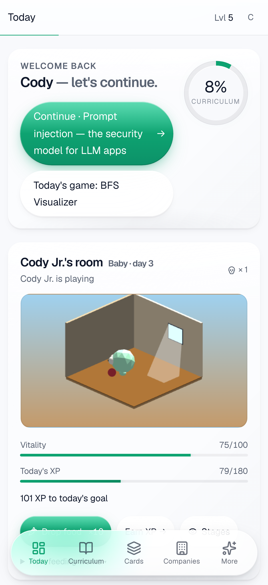
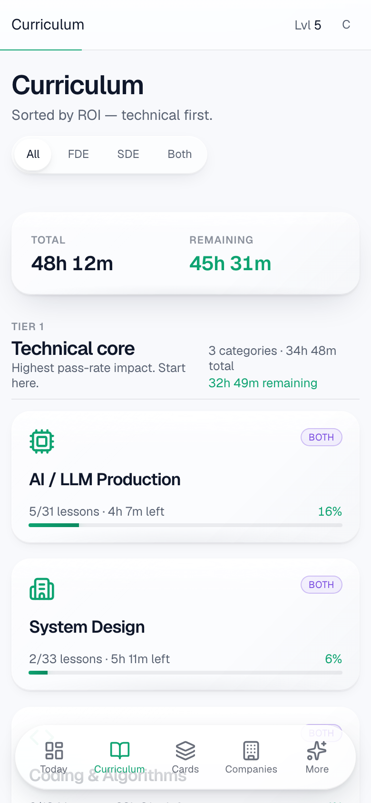
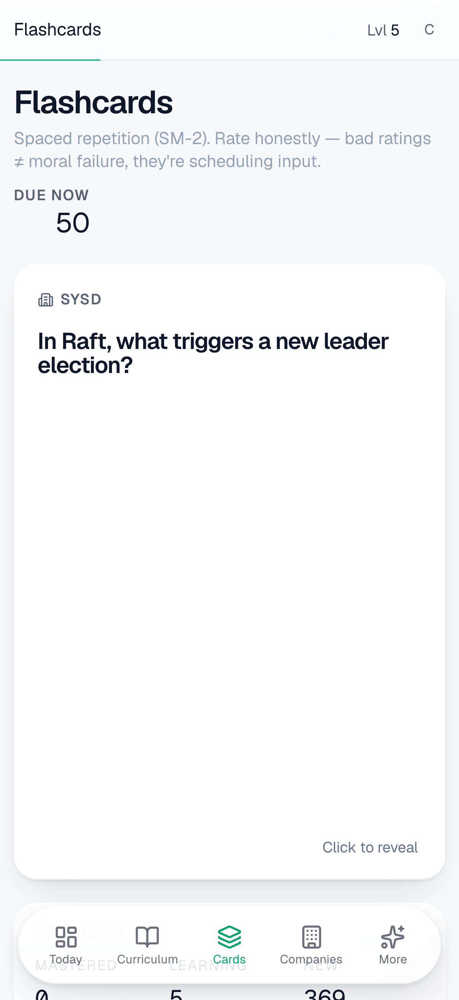
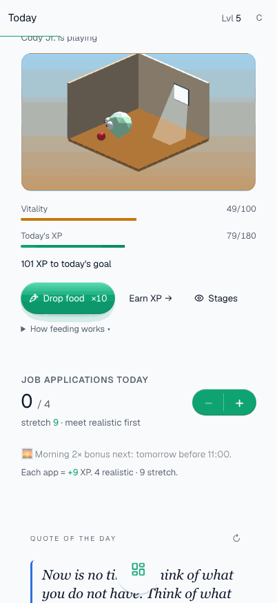
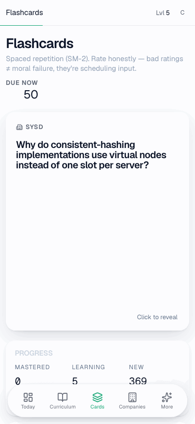
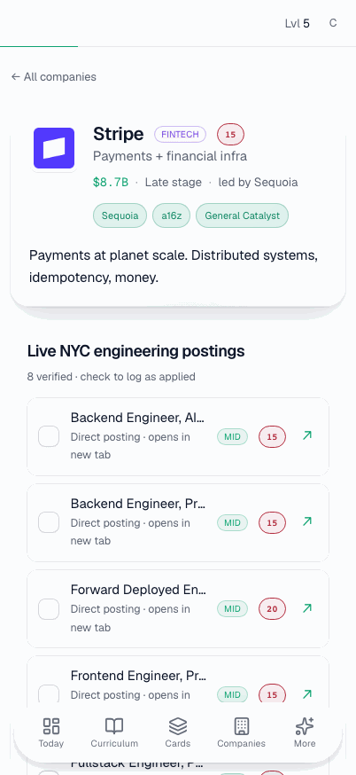

# Interview Prep — FDE / SDE 2026

Static vanilla HTML/CSS/JS prep app for Forward-Deployed-Engineer and SDE
interviews. No build step, no bundler. Hosted on GitHub Pages at
<https://codyhsieh.com/interview-prep/>.

## Screenshots

Mobile (iPhone 17 Pro portrait) — re-generated via
`node scripts/screenshots.mjs` (stills) and `node scripts/screenshot-gifs.mjs`
(interactive GIFs).

| Today | Curriculum | Flashcards (SM-2) |
|:-:|:-:|:-:|
|  |  |  |
| **Drop-food → Bit eats** | **Flashcard flip + rate** | **Company detail (scroll)** |
|  |  |  |

## What's in it

- **10 curriculum categories**, ~150 concept lessons, ~760 interactive items
  (MCQ / T-F / flashcard / cloze / whyexplain).
- **SM-2 flashcard SRS** with wrong-answer + concept-rating queues.
- **Bit, a low-poly Three.js pet** that lives in an isometric room (or an
  open pasture with a lush bonsai apple tree when his form hits *jacked*).
- **Cross-device sync** via a tiny Cloudflare Worker + KV — pair two devices
  by short code, state merges (deletes via tombstones), polls every 2.5 s.
- **Mini-games**, STAR-story bank, mock-interview log, companies view,
  daily quote, daily quests.

State lives in `localStorage`; the optional sync layer mirrors it remotely.

## Architecture

| | |
|---|---|
| Frontend | Vanilla JS, Tailwind via CDN, Three.js r148, Prism, Chart.js |
| Sync backend | Cloudflare Worker + KV, ~75 lines (see `cloudflare/`) |
| Persistence | `localStorage` (`fdeprep.v1`), serialized to one JSON blob |
| SRS | SM-2 on flashcards + concept reviews |
| Pet | Procedural Three.js — sun-arc lighting, GPU grass shader, ramified bonsai |
| Sign-in | Liquid Glass gate; pairing code is the credential |

Single-file modules: `js/data.js` (curriculum) · `js/views.js` (UI) ·
`js/gamification.js` (XP/SRS/pet) · `js/games.js` · `js/sync.js`.

## Run locally

```sh
python3 -m http.server 8000      # then http://localhost:8000
```

## Tests + tooling

```sh
node scripts/sync-stress.mjs     # unit + e2e tests for the sync layer
node tests/window-beam.test.js   # sun-beam geometry math
node scripts/perf/clickthrough.mjs  # Playwright trace through all routes (writes scripts/perf/perf-report.md)
node scripts/screenshots.mjs     # Re-generate README stills (needs `python3 -m http.server 8000` running)
node scripts/screenshot-gifs.mjs # Re-generate README interactive GIFs
```

## Cross-device sync setup

Deployed Worker at `interview-prep-sync.codyjhsieh.workers.dev`. To redeploy
from scratch see `cloudflare/README.md`. Pair flow: Profile → Generate code
on device A → enter same code on device B. State unions; deletes propagate.

## License

Not specified. Personal project.
